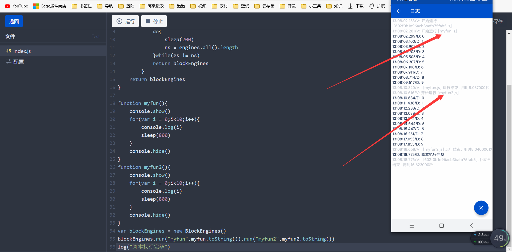

# Hamibot技巧总结
## BlockEngines 工具
>使用场景:
    
    在写校园集结号报平安脚本的时候，报平安界面，点击我要报平安按钮，弹出选择口号和
    选择提问的选项，但是主线程脚本获取到的体温控件位置超出了屏幕范围，经过不断地尝试，
    发现执行另外一个脚本能获取到正常的坐标位置，原方法使用了engines.exeScript()方法，
    启动另一个脚本，在这里函数可以看作另一个脚本。但是，两个脚本是异步执行，没有说是
    子脚本启动了，主线程脚本就阻塞了，我们有时候是需要阻塞的，那么可以使用BlockEngines
    BlockEngines属于伪阻塞，可以使用BlockEngines同时启动多个子脚本。按顺序执行
    大家可以去写一下校园集结号上报界面自动选择口号和体温的功能。不过脚本要从点击我要上报按钮开始写！

>示例源码

    BlockEngines.js

>使用步骤：

1. 引入BlockEngines 
   
    ```js
    var BlockEngines = {
        instance : function(){
            let blockEngines = {}
            blockEngines.run = function(name,funstr){
                let es = engines.all().length
                let ns = 0
                engines.execScript(name, name+"();\n" + funstr);
                do{
                    sleep(200)
                    ns = engines.all().length
                }while(es != ns)
                return blockEngines
            }
            return blockEngines
        }
    }
    ```
2. 创建子脚本（函数）
   
    ```js
    function myfun(){
  		console.show()
  		for(var i = 0;i<10;i++){
       		console.log(i)
        	sleep(800)
        }
        console.hide()
    }
   function myfun2(){
  		console.show()
  		for(var i = 0;i<10;i++){
       		console.log(i)
        	sleep(800)
        }
        console.hide()
    }
    ```

3. 运行子脚本 
   ```js
    BlockEngines.instance().run("myfun",myfun.toString())
                          .run("myfun2",myfun2.toString())
   ```
    